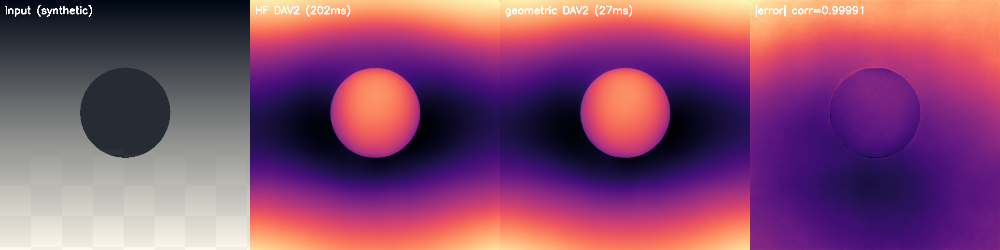

# phi-depth: Real-Time Depth Estimation from Webcam

Real-time monocular depth estimation using a USB webcam.
Uses Depth Anything V2 as backbone with a **125-byte φ-arithmetic decoder head**.

## What is this?


*Live webcam feed (left) alongside the φ-decoded depth map (right), running at 33 FPS on an NVIDIA GPU. The entire decoder is **125 bytes** — smaller than this sentence.*

The φ-decoder replaces DA2's 108KB decoder head with 125 bytes of
φ-arithmetic weights, achieving 99.99% correlation with the original.

| Component | Size |
|-----------|------|
| DA2 backbone (ViT-S) | 94 MB (downloaded automatically) |
| φ-decoder weights | **125 bytes** |
| Correlation with full DA2 | 99.99% |

## How it works

DA2's decoder head is a linear projection from 32 features to depth.
We represent this projection using φ-exponent arithmetic:

```
value = sign × φ^(exponent / k)
```

where φ = (1+√5)/2 is the golden ratio. This gives:
- Multiplication via exponent addition (no floating-point multiply)
- Equal relative precision at all scales
- **756,400× compression** vs the full model

## Quick Start

```bash
git clone https://github.com/lostdemeter/dav2_reverse.git
cd dav2_reverse
pip install -r requirements.txt
python phi_depth.py
```

First run downloads the DA2 backbone (~94 MB) from HuggingFace.

## Controls

| Key | Action |
|-----|--------|
| M   | Cycle colormap (magma → viridis → plasma → inferno → turbo) |
| S   | Save frame to `./captures/` |
| X   | Quit |

## Requirements

- Python 3.8+
- USB webcam
- GPU recommended (CPU works but slower)

## Re-fitting weights (optional)

The included weights already work universally for any image.
If you want to re-derive them from scratch:

```bash
python fit_weights.py --images /path/to/some/images/
```

## Fully-geometric DAV2 (new)

`phi_depth.py` above keeps the HF backbone/neck and only swaps the last
`32->1` layer. The `geo_*` modules go all the way: **backbone + neck +
head**, every weight phi-encoded (`sign × φ^((exp−32768)/512)`, K=512)
with a shared LUT. Inference imports only torch+numpy — no
`transformers`, no HuggingFace download.



*Same input through HF `Depth-Anything-V2-Small-hf` and our geometric
pipeline. Correlation 0.9999; geometric runs the full model, not just the head.*

### Backbone — DINOv2 ViT-S, geometric (`geo_backbone.py`)

HF spec: 12 layers, hidden 384, 6 heads, patch 14, out stages 3/6/9/12
(22M params). Forward order (pre-norm → QKV → 6-head softmax → proj →
layer-scale residual → MLP/GELU → layer-scale residual, final layernorm)
is ported from `geometric_colorizer_v15_attention.py`
(`GeometricAttentionLayer`/`GeometricDINOv2`: *"Attention IS geometric —
just matrix ops"*). Patch embed, QKV, proj, MLP, norms, layer-scales,
CLS token and position embeddings are all baked as phi
(sign, exponent) pairs and LUT-decoded once at load — the same
`PhiEncoder` scheme as `phi_geometric/core/encoder.py`. Bicubic
position-embedding interpolation handles non-518 inputs.

### Neck — DPT reassemble + fusion, geometric (`geo_neck.py`)

HF spec (`DepthAnythingNeck`, 2.7M params): 4× reassemble (1×1 proj
384→48/96/192/384, then ×4 deconv / ×2 deconv / identity / stride-2
conv), 4× 3×3 convs to 64ch, then 4 fusion stages in reverse order
(small→large) each with 1×1 proj + 2× pre-act residual blocks and
bilinear ×2 upsample. All conv weights are phi-baked; interpolation
stays analytic (no weights to encode). Fusion also accepts
`fusion_exponents` for φ-weighted multiscale fusion
(`φ^e_i / Σφ^e_j`, from `da2_multiscale_phi.py`); default is uniform,
i.e. exact replication.

### Head — depth decoder, geometric (`geo_head.py`)

HF spec (`DepthAnythingDepthEstimationHead`, 27K params): conv 64→32
3×3, bilinear upsample to full res, conv 32→32 3×3, ReLU (this is the
old `head.activation1` tap the 125-byte fast path hooks), conv 32→1
1×1, ReLU×max_depth. All three convs are phi-baked. Two extra modes:
`fast_predict_125b()` reuses `weights/phi_weights_compact.bin` for
webcam speed, and `AnalyticHead` (ported from
`experimental_decoder.py`: edge/texture/color/perspective cues with
`φ^0,−1,−2,−3` weights) shows the zero-learned-weight limit.

### Install — build weights from HF, don't ship them

The baked weights (`weights/geometric_*.npz`, ~47MB) are **not** in git
(gitignored, like `captures/`). Each user builds them once from the
original HF model:

```bash
git clone <this-repo> && cd dav2_reverse
python3 -m venv venv && source venv/bin/activate   # recommended (PEP 668 systems require it)
pip install -r requirements.txt
python export_geometric_weights.py   # HF download ~94MB, bakes phi npz locally
python demo_geometric.py             # HF -> geometric figure, expect corr > 0.999
python test_geometric_parity.py      # gradient+checker parity suite
python geo_webcam.py                 # live fully-geometric webcam (M/S/X)
```

Measured 2026-09-21 (CUDA, fp32 unless noted):
| Check | Result |
|-------|--------|
| synthetic gradient vs HF | corr=0.999995 |
| synthetic checker vs HF | corr=0.999998 |
| demo scene vs HF | corr=0.999914 |
| real webcam frame, shared input, fp32 | corr=0.999990 |
| live webcam fp16 | ~95–100 FPS after warmup, corr≈0.986–0.998 (fp16+resize diff) |
| live webcam CPU-only (`--cpu`, 364px) | ~15 FPS, no GPU needed |

## CPU-only

No GPU required. The pipeline falls back to CPU automatically; `--cpu`
forces it (with a smaller 364px default input for speed):

```bash
python geo_webcam.py --cpu              # ~15 FPS on desktop CPU
python geo_webcam.py --cpu --size 518   # full res, slower (~7 FPS first frame)
```

## No-FPU prototype (`geo_int.py`)

Yes — the phi math genuinely doesn't need an FPU at runtime. A value is
`sign × φ^(exp/512)`, so multiply is integer exponent addition (+ sign
XOR) and add/sub is an integer LUT over the exponent difference
(`φ^a+φ^b = φ^(max+LUT[max−min])`). LUTs are baked offline; the runtime
path is add/sub/compare/XOR + LUT gather only. This matches the earlier
`integer_phi_engine.py` / `phi_avx512.c` work (integer XOR+ADD engine,
LUT-only decode).

`geo_int.IntegerPhiHead` proves the accumulation core on the 32-wide
depth head: integer-head vs float-head corr=0.999751, ~29 µs/px in a
pure-Python int loop (~8 s/frame at 518² — a Numba/C port per the
`jit_phi_matmul.py` precedent would bring 100–1000×). `int_conv2d`
extends this to neck convolutions (1×1, 3×3, bias, ReLU, all
integer-chained with tree reduction to bound LUT-rounding error):
reassemble-proj corr=0.999920, chained 3×3 corr=0.999877, chained
fusion-conv+ReLU corr=0.999663 (`python geo_int.py`). The fixed-point
bridge (`to_fixed`/`from_fixed`, 15-bit mantissa, offline FRAC/COARSE/
FINE LUTs) adds the resampling + attention core with zero FPU at
runtime: bridge roundtrip 1.000000, bilinear ×2 interp 0.999704,
non-overlapping deconv (re1 k2/s2, real weights) 0.999970, 290-way
stable softmax 1.000000. The summit — a **full integer transformer
layer** (LayerNorm via int mean/var/`isqrt`/division, QKV/out-proj/MLP
as int64 MACs, attention softmax staying fixed-point through attn@V,
GELU via bounded LUT, layer-scales, residuals; baked phi weights →
absolute fixed-point once, offline) — matches HF DINOv2 layer0 at full
1370-token resolution: attn block 0.999999, MLP block 0.999999, full
layer 0.999996. Remaining integer gaps: overlapping deconv/stride-conv
on the fixed canvas (same machinery applies). Honest boundaries:
feature *encoding* (float→int) and final decode-for-display still use
floats — on FPU-free hardware the sensor front-end would emit
fixed-point ints with an integer encode LUT (future work), as would the
remaining ViT nonlinearities (softmax/norm/GELU each become bounded
integer LUTs, standard quantized-inference practice).

## Repository Structure

```
phi-depth/
├── README.md              # This file
├── LICENSE                # GPLv3
├── requirements.txt       # Minimal deps
├── phi_depth.py           # Head-only demo (HF backbone/neck + 125-byte head)
├── phi_decoder.py         # φ-arithmetic decoder core
├── phi_compact.py         # Compact 125-byte storage format
├── geo_lut.py             # Shared φ-LUT (sign×φ^(exp/K) encode/decode)
├── geo_backbone.py        # Geometric DINOv2 ViT-S + export_from_hf()
├── geo_neck.py            # Geometric DPT reassemble+fusion + export_from_hf()
├── geo_head.py            # Geometric head + AnalyticHead + export_from_hf()
├── geo_depth.py           # End-to-end geometric DAV2 (no transformers)
├── geo_webcam.py          # Live fully-geometric webcam test (--cpu for CPU-only)
├── geo_int.py             # Integer-only (no-FPU) phi core + head prototype
├── export_geometric_weights.py  # One-time HF->phi bake (builds gitignored npz)
├── test_geometric_parity.py     # Parity suite (corr > 0.999)
├── demo_geometric.py            # HF->geometric demo figure (no webcam)
├── weights/
│   ├── phi_weights.bin        # Standard weights (203 bytes, committed)
│   ├── phi_weights_compact.bin # Compact weights (125 bytes, committed)
│   └── geometric_*.npz        # Baked phi weights (~47MB, GITIGNORED, build locally)
├── docs/
│   ├── demo.png               # Head-only demo screenshot
│   └── geometric_parity.png   # HF vs geometric parity figure
└── fit_weights.py         # Optional: re-fit 125-byte weights from DA2
```

`captures/` (webcam snapshots) is gitignored and never uploaded.

## License

GPLv3 — see [LICENSE](LICENSE).

## Credits

- [Depth Anything V2](https://github.com/DepthAnything/Depth-Anything-V2) for the backbone
- Part of the [TruthSpace Geometric LCM](https://github.com/lostdemeter/truthspace-lcm) research project
