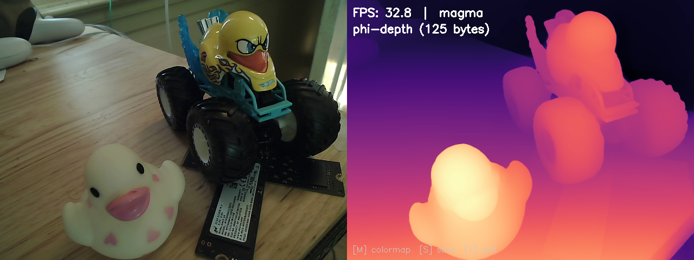

# phi-depth: Real-Time Depth Estimation from Webcam

Real-time monocular depth estimation using a USB webcam.
Uses Depth Anything V2 as backbone with a **125-byte φ-arithmetic decoder head**.

## What is this?



*Live webcam feed (left) alongside the φ-decoded depth map (right), running at 33 FPS on an NVIDIA GPU. The entire decoder is **125 bytes** — smaller than this sentence.*

The φ-decoder replaces DA2's 108KB decoder head with 125 bytes of
φ-arithmetic weights, achieving 99.99% correlation with the original.

| Component | Size |
|-----------|------|
| DA2 backbone (ViT-S) | 94 MB (downloaded automatically) |
| φ-decoder weights | **125 bytes** |
| Correlation with full DA2 | 99.99% |

## How it works

DA2's decoder head is a linear projection from 32 features to depth.
We represent this projection using φ-exponent arithmetic:

```
value = sign × φ^(exponent / k)
```

where φ = (1+√5)/2 is the golden ratio. This gives:
- Multiplication via exponent addition (no floating-point multiply)
- Equal relative precision at all scales
- **756,400× compression** vs the full model

## Quick Start

```bash
git clone https://github.com/lostdemeter/dav2_reverse.git
cd dav2_reverse
pip install -r requirements.txt
python phi_depth.py
```

First run downloads the DA2 backbone (~94 MB) from HuggingFace.

## Controls

| Key | Action |
|-----|--------|
| M   | Cycle colormap (magma → viridis → plasma → inferno → turbo) |
| S   | Save frame to `./captures/` |
| X   | Quit |

## Requirements

- Python 3.8+
- USB webcam
- GPU recommended (CPU works but slower)

## Re-fitting weights (optional)

The included weights already work universally for any image.
If you want to re-derive them from scratch:

```bash
python fit_weights.py --images /path/to/some/images/
```

## Repository Structure

```
phi-depth/
├── README.md              # This file
├── LICENSE                # GPLv3
├── requirements.txt       # Minimal deps
├── phi_depth.py           # Main entry point (webcam → side-by-side display)
├── phi_decoder.py         # φ-arithmetic decoder core
├── phi_compact.py         # Compact 125-byte storage format
├── weights/
│   ├── phi_weights.bin        # Standard weights (203 bytes)
│   └── phi_weights_compact.bin # Compact weights (125 bytes)
├── docs/
│   └── demo.png           # Demo screenshot
└── fit_weights.py         # Optional: re-fit weights from DA2
```

## License

GPLv3 — see [LICENSE](LICENSE).

## Credits

- [Depth Anything V2](https://github.com/DepthAnything/Depth-Anything-V2) for the backbone
- Part of the [TruthSpace Geometric LCM](https://github.com/lostdemeter/truthspace-lcm) research project
